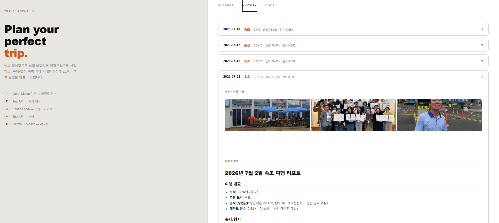
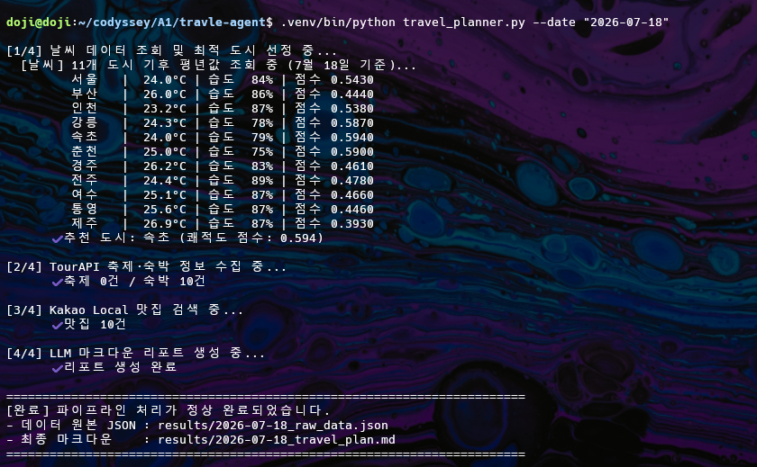

# 국내 여행 추천 CLI

날짜를 입력하면 실시간 기후 데이터로 최적 여행지를 선별하고, 축제·맛집·숙박 정보를 수집해 LLM이 1일 여행 리포트(Markdown)를 생성하는 CLI 프로그램.

## 아키텍처

```
[입력: --date YYYY-MM-DD]
        │
        ▼
① Open-Meteo (기후 평년값)  ──>  11개 후보 도시 쾌적도 점수 계산 (LLM 미사용)
        │
        ▼  최적 도시 선정
        ├──> ② TourAPI searchFestival2  (날짜+지역 → 축제/행사)
        ├──> ③ Kakao Local              (도시명 → 맛집 10곳)
        └──> ④ TourAPI searchStay2      (지역 → 숙박 10곳)
        │
        ▼
⑤ OpenRouter LLM (google/gemini-2.5-flash)
   수집 데이터 → 오전/오후/저녁 일정 포함 마크다운 리포트
        │
        ▼
[결과: results/{DATE}_raw_data.json + {DATE}_travel_plan.md]
```



> **캐시**: 동일 날짜를 재실행하면 `results/` 파일을 그대로 반환하고 모든 API 호출을 생략한다.

## Docker (권장)

API 키만 넣으면 환경 설치 없이 바로 실행된다.

```bash
# 1. 키 파일 준비
cp .env.example .env
# .env 파일을 열어 세 가지 키 입력

# 2. 빌드 + 실행 (최초 1회)
docker compose up --build -d

# 3. 브라우저 접속
http://localhost:8000

# 중지
docker compose down
```

생성된 리포트는 호스트의 `./results/` 폴더에 저장되어 컨테이너를 삭제해도 유지된다.

키를 바꾸려면 `.env` 수정 후 `docker compose restart`만 하면 된다.

### Docker Hub 이미지 (`42doji/travel-agent`)

빌드된 이미지는 Docker Hub `42doji/travel-agent`에 배포되어 있다. 소스를 받지 않고도 이미지만 받아 바로 실행할 수 있다.

```bash
# 1. 이미지 받기
docker pull 42doji/travel-agent:latest

# 2. 키 파일 준비 (results 저장용 폴더도 함께 생성)
mkdir -p results
cp .env.example .env   # .env 열어 세 가지 키 입력

# 3. 실행
docker run -d \
  --name travel-agent \
  -p 8000:8000 \
  --env-file .env \
  -v "$(pwd)/results:/app/results" \
  42doji/travel-agent:latest

# 4. 브라우저 접속
http://localhost:8000

# 상태 확인 / 로그 / 중지
docker ps
docker logs -f travel-agent
docker rm -f travel-agent
```

#### 이미지 직접 빌드 & 푸시 (배포자용)

코드 수정 후 Docker Hub 이미지를 갱신하려면:

```bash
# 1. 로그인 (최초 1회)
docker login

# 2. 빌드
docker build -t 42doji/travel-agent:latest .

# 3. 푸시
docker push 42doji/travel-agent:latest
```

---

## 로컬 설치

```bash
# 1. 가상환경 생성 및 활성화
python3 -m venv .venv
source .venv/bin/activate        # Windows: .venv\Scripts\activate

# 2. 의존성 설치
pip install -r requirements.txt
```

## 환경변수 설정

`.env.example`을 복사해 `.env`를 만들고 API 키를 입력한다.

```bash
cp .env.example .env
```

```ini
# .env
OPENROUTER_API_KEY=sk-or-v1-xxxxxxxx   # https://openrouter.ai
KAKAO_REST_API_KEY=xxxxxxxxxxxxxxxx     # https://developers.kakao.com
TOUR_API_KEY=xxxxxxxxxxxxxxxx           # https://www.data.go.kr
```

### API 키 발급 안내

| 서비스 | 발급처 | 비고 |
|--------|--------|------|
| OpenRouter | [openrouter.ai/keys](https://openrouter.ai/keys) | `google/gemini-2.5-flash` 모델 사용 |
| Kakao Local | [developers.kakao.com](https://developers.kakao.com) → 앱 생성 → REST API 키 | 카카오맵 서비스 활성화 필요 |
| TourAPI | [data.go.kr](https://www.data.go.kr) → "한국관광공사_국문 관광정보 서비스_GW" 활용신청 | End Point: `KorService2` |

## 실행

### CLI

```bash
# 정상 실행
python travel_planner.py --date "2026-10-24"

# 잘못된 날짜 형식 → 에러 메시지 출력 후 종료
python travel_planner.py --date "2026-13-99"

# 오늘 이전 날짜 → 종료
python travel_planner.py --date "2026-01-01"

# 1년 초과 → 종료
python travel_planner.py --date "2028-01-01"
```

### 웹 서버

```bash
# 서버 시작 (reload 모드 — 코드 변경 시 자동 재시작)
.venv/bin/python server.py

# 브라우저에서 접속
http://localhost:8000
```

| 기능 | 설명 |
|------|------|
| Planner 탭 | 날짜 선택 → 실시간 로그 스트리밍 → 마크다운 리포트 + 사진 카드 |
| History 탭 | 과거 생성된 리포트 목록 → 클릭 시 토글로 결과 확인 |
| Docs 탭 | 요구사항·파이프라인·API·스키마 설명 |

> 동일 날짜를 다시 실행하면 캐시(`results/`)에서 즉시 반환하며 API 호출을 생략한다.

### API 호출 예시 (curl)

`/api/plan`은 SSE(Server-Sent Events)로 응답한다. `-N`(no-buffer) 옵션을 붙여야 스트리밍 로그가 실시간으로 보인다.

```bash
# 올바른 요청 — 오늘(2026-07-01) 이후 ~ 1년 이내 날짜
curl -N "http://localhost:8000/api/plan?date=2026-07-15"
```

```bash
# 잘못된 요청 — 형식 오류(월 13, 일 99) → HTTP 400 반환
curl -i "http://localhost:8000/api/plan?date=2026-13-99"
# {"detail":"올바르지 않은 날짜 형식: '2026-13-99'. YYYY-MM-DD 형식을 사용하세요."}

# 잘못된 요청 예시 — 과거 날짜도 동일하게 400
curl -i "http://localhost:8000/api/plan?date=2026-01-01"
# {"detail":"'2026-01-01'은 오늘 이전 날짜입니다. 내일 이후 날짜를 입력하세요."}
```

### CLI 실행 결과 예시

```
[1/4] 날씨 데이터 조회 및 최적 도시 선정 중...
  [날씨] 11개 도시 기후 평년값 조회 중 (10월 24일 기준)...
         서울   |  15.2°C | 습도  68% | 점수 0.7210
         ...
      ✔ 추천 도시: 경주 (쾌적도 점수: 0.821)

[2/4] TourAPI 축제·숙박 정보 수집 중...
      ✔ 축제 3건 / 숙박 10건

[3/4] Kakao Local 맛집 검색 중...
      ✔ 맛집 10건

[4/4] LLM 마크다운 리포트 생성 중...
      ✔ 리포트 생성 완료

========================================================================
[완료] 파이프라인 처리가 정상 완료되었습니다.
- 데이터 원본 JSON : results/2026-10-24_raw_data.json
- 최종 마크다운    : results/2026-10-24_travel_plan.md
========================================================================
```

### 결과 파일

| 파일 | 내용 |
|------|------|
| `results/{DATE}_raw_data.json` | 수집된 원본 데이터 + 에러 로그 |
| `results/{DATE}_travel_plan.md` | LLM이 작성한 오전/오후/저녁 일정 포함 여행 리포트 |

## 보안 가이드

**API 키는 절대 코드에 하드코딩하지 않는다.**

`.env` 파일은 `.gitignore`에 등록되어 있어 Git에 커밋되지 않는다. 키가 공개 저장소에 노출될 경우:

- **OpenRouter 키**: 무단 LLM API 호출로 즉각 과금 피해
- **Kakao 키**: 위치/검색 API 악용, 쿼터 소진
- **TourAPI 키**: 공공데이터 포털 계정 제재 가능성

키가 노출되었다면 즉시 해당 서비스 콘솔에서 **키 재발급 또는 폐기** 처리한다.

```bash
# 커밋 전 반드시 확인
git status          # .env가 목록에 없어야 함
git diff --cached   # 키 문자열이 포함되어 있지 않아야 함
```
