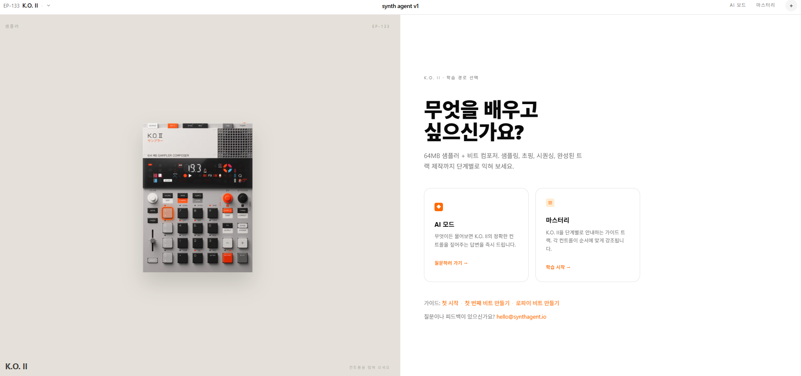
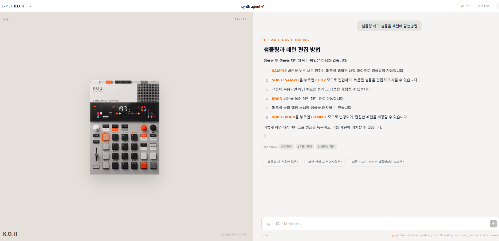

# Synth Agent

Teenage Engineering 장비(EP-133 K.O. II, OP-1 Field, TX-6)를 위한 인터랙티브 학습 가이드.
매뉴얼을 기반으로 한 AI 챗봇과 단계별 튜토리얼을 제공합니다.

**프로덕션:** https://synth-agent.vercel.app

| 홈 화면 | AI 챗봇 |
|--------|---------|
|  |  |

---

## 기능

### AI 모드
- 장비에 대해 자유롭게 질문하면 매뉴얼 내용을 기반으로 답변
- 스트리밍 방식으로 텍스트가 실시간으로 출력됨
- 첫 진입 시 추천 질문 1개 제시 → 답변 후 후속 질문 3개 자동 추천
- 컨트롤 버튼 이름은 오렌지색 볼드로 강조 표시

### 마스터리 (단계별 튜토리얼)
- 장비별 학습 가이드 목록 제공
- 각 스텝 진행 시 왼쪽 장비 다이어그램에서 해당 컨트롤이 시각적으로 강조됨
- 스텝을 클릭하면 다이어그램의 해당 버튼이 하이라이트

### 장비 지원
| 장비 | 설명 |
|------|------|
| EP-133 K.O. II | 64MB 샘플러 + 비트 컴포저 |
| OP-1 Field | 휴대용 신디사이저 + 4트랙 테이프 레코더 |
| TX-6 | 포켓 사이즈 6채널 스테레오 믹서 |

---

## 프로젝트 구조

```
3_synth_agent/
├── api/
│   ├── __init__.py        # Vercel Python 모듈 진입점
│   └── chat.py            # Flask 앱 — /api/chat, /api/health 엔드포인트
├── frontend/
│   ├── src/
│   │   ├── App.tsx
│   │   ├── components/
│   │   │   ├── AiView.tsx         # AI 챗봇 UI (SSE 스트리밍)
│   │   │   ├── TutorialView.tsx   # 마스터리 튜토리얼
│   │   │   ├── GuideListView.tsx  # 가이드 목록
│   │   │   ├── HomeView.tsx       # 홈 (모드 선택)
│   │   │   ├── DevicePanel.tsx    # 장비 다이어그램
│   │   │   └── Header.tsx
│   │   └── data/
│   │       └── mockData.ts        # 장비·가이드 데이터
│   ├── vite.config.ts
│   └── package.json
├── pyproject.toml         # Python 의존성 + Vercel 설정
├── vercel.json            # 빌드 커맨드
└── .env.example
```

---

## 로컬 개발 환경 설정

### 요구 사항

- Node.js 18+
- Python 3.12+
- [Vercel CLI](https://vercel.com/docs/cli) (`npm i -g vercel`)
- [OpenRouter](https://openrouter.ai) API 키

### 1. 환경 변수 설정

```bash
cp .env.example .env
```

`.env` 파일에 OpenRouter API 키를 입력합니다:

```
OPENROUTER_API_KEY=sk-or-v1-...
```

### 2. 프론트엔드 의존성 설치

```bash
cd frontend
npm install
```

### 3. 로컬 서버 실행

프로젝트 루트에서 Vercel Dev 서버를 실행합니다 (Python 백엔드 + 프론트엔드 프록시 포함):

```bash
npx vercel dev
```

브라우저에서 `http://localhost:3000` 접속.

> `vite.config.ts`의 프록시 설정으로 `/api` 요청이 자동으로 `localhost:3000`으로 라우팅됩니다.

---

## Vercel 배포

### 최초 배포

```bash
npx vercel
```

대화형 설정을 따라 프로젝트를 연결합니다.

### 환경 변수 등록

Vercel 대시보드 → Settings → Environment Variables에서 `OPENROUTER_API_KEY`를 추가하거나 CLI로 등록합니다:

```bash
npx vercel env add OPENROUTER_API_KEY
```

### 프로덕션 배포

```bash
npx vercel --prod
```

---

## API

### `POST /api/chat`

AI 챗봇 엔드포인트. 두 가지 모드로 동작합니다.

**초기 추천 질문 요청** (`messages`가 빈 배열인 경우):

```json
// Request
{ "messages": [], "deviceSlug": "ep-133" }

// Response (JSON)
{ "type": "initial", "suggestion": "샘플은 어떻게 녹음하나요?" }
```

**대화 요청** (`messages`에 내용이 있는 경우):

```json
// Request
{
  "messages": [{ "role": "user", "content": "샘플은 어떻게 녹음하나요?" }],
  "deviceSlug": "ep-133"
}
```

응답은 **Server-Sent Events (SSE)** 스트림으로 반환됩니다:

```
data: {"type": "chunk", "text": "EP-133에서 샘플을 녹음하려면..."}
data: {"type": "chunk", "text": " **SAMPLE** 버튼을 누른 채"}
...
data: {"type": "done", "heading": "샘플 녹음 방법", "suggestions": ["...","...","..."], "tags": ["녹음","샘플러"]}
```

| 이벤트 타입 | 설명 |
|------------|------|
| `chunk` | 텍스트 조각 (스트리밍 중) |
| `done` | 스트리밍 완료. heading·suggestions·tags 포함 |
| `error` | 오류 발생 시 |

### `GET /api/health`

```json
{ "status": "ok", "key_set": true }
```

---

## 기술 스택

| 레이어 | 기술 |
|--------|------|
| 프론트엔드 | React 19, TypeScript, Vite, Tailwind CSS v4 |
| UI 컴포넌트 | Radix UI, lucide-react |
| 백엔드 | Flask (Python 3.12), Vercel Serverless |
| AI | OpenRouter API (`anthropic/claude-3-haiku`) |
| 스트리밍 | Server-Sent Events (SSE) |
| 배포 | Vercel (uv 기반 Python 런타임) |
