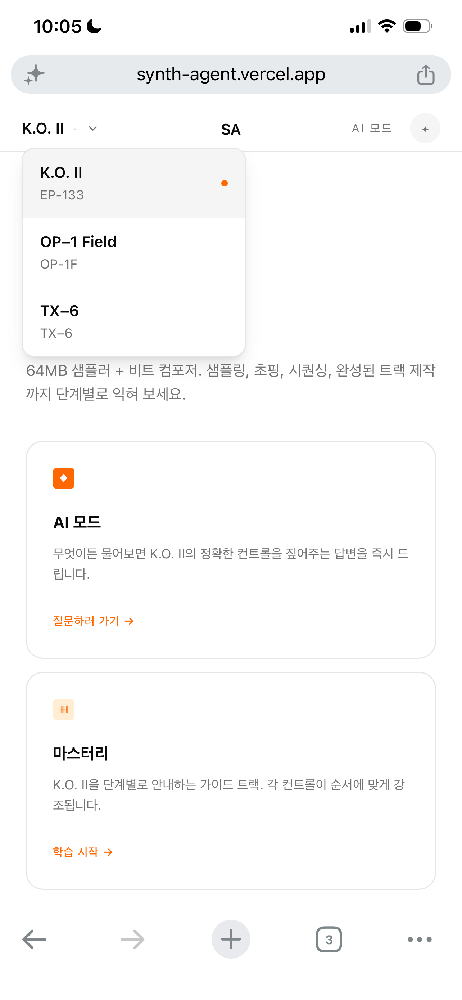
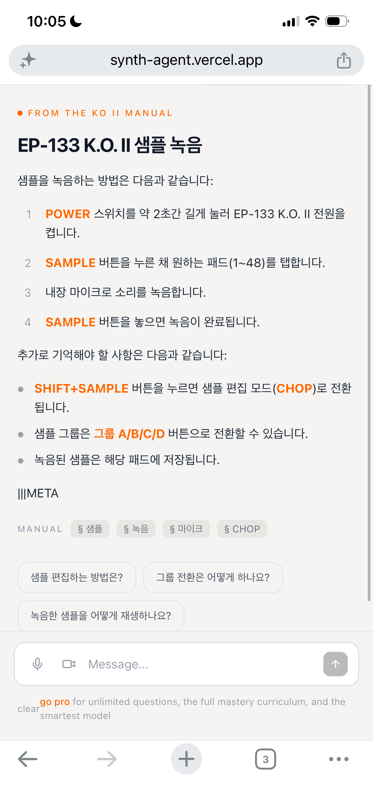
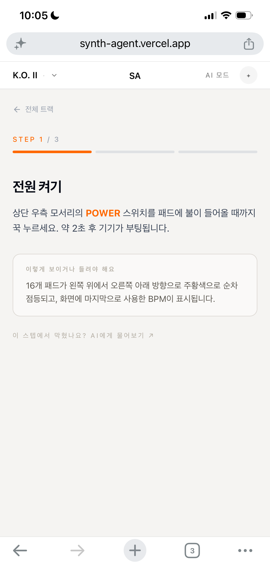

# Synth Agent

Teenage Engineering 장비(EP-133 K.O. II, OP-1 Field, TX-6)를 위한 AI 기반 인터랙티브 매뉴얼 가이드.
자연어 질문에 매뉴얼 내용으로 답변하는 AI 챗봇과 단계별 튜토리얼을 제공합니다.

**프로덕션:** https://synth-agent.vercel.app

**데스크톱**

| 홈 화면 | AI 챗봇 |
|--------|---------|
|  |  |

**모바일**

| 홈 · 장비 선택 | AI 챗봇 | 마스터리 튜토리얼 |
|-------------|--------|--------------|
|  |  |  |

---

## 문서

| 문서 | 설명 |
|------|------|
| [서비스 기획서](docs/planning.html) | 서비스 목적, 타겟 사용자, 페이지 구성, AI 기능 명세 |
| [기술 해설](docs/explainer.html) | HTML/CSS/JS 역할, fetch 흐름, Serverless, 환경 변수, 배포 |

---

## 기능

### AI 모드
- 장비에 대해 자유롭게 질문하면 매뉴얼 내용을 기반으로 답변
- SSE 스트리밍으로 텍스트가 실시간 출력 (첫 단어부터 즉시 표시)
- 첫 진입 시 추천 질문 1개 제시 → 답변 후 후속 질문 3개 자동 추천
- 컨트롤 버튼 이름 오렌지색 볼드 강조, 번호·불릿 목록 자동 파싱

### 마스터리 (단계별 튜토리얼)
- 장비별 학습 가이드 목록
- 스텝 진행 시 장비 다이어그램에서 해당 컨트롤 하이라이트

### 공통
- 헤더 드롭다운으로 장비 전환 (EP-133 / OP-1F / TX-6)
- 모바일 반응형 (768px 기준, 장비 패널 숨김)

### 장비 지원
| 장비 | 설명 |
|------|------|
| EP-133 K.O. II | 64MB 샘플러 + 비트 컴포저 |
| OP-1 Field | 휴대용 신디사이저 + 4트랙 테이프 레코더 |
| TX-6 | 포켓 사이즈 6채널 스테레오 믹서 |

---

## 프로젝트 구조

```
3_synth_agent/
├── api/
│   ├── __init__.py        # Vercel Python 모듈 진입점
│   └── chat.py            # Flask 앱 — /api/chat, /api/health
├── frontend/              # React + Vite (배포 빌드)
│   ├── src/
│   │   ├── App.tsx
│   │   └── components/
│   │       ├── AiView.tsx         # AI 챗봇 (SSE 스트리밍)
│   │       ├── TutorialView.tsx   # 마스터리 튜토리얼
│   │       ├── GuideListView.tsx  # 가이드 목록
│   │       ├── HomeView.tsx       # 홈 (모드 선택)
│   │       ├── DevicePanel.tsx    # 장비 다이어그램
│   │       └── Header.tsx
│   └── src/data/mockData.ts      # 장비·가이드 데이터
├── html/                  # 순수 HTML/CSS/JS 버전 (의존성 없음)
│   ├── index.html
│   ├── style.css
│   └── app.js
├── docs/                  # 문서 및 스크린샷
│   ├── planning.html      # 서비스 기획서
│   ├── explainer.html     # 기술 해설
│   └── screenshot-*.png
├── pyproject.toml         # Python 의존성 + Vercel 진입점 설정
├── vercel.json            # 빌드 커맨드
└── .env.example
```

---

## 로컬 개발 환경 설정

### 요구 사항

- Node.js 18+
- Python 3.12+
- [Vercel CLI](https://vercel.com/docs/cli) (`npm i -g vercel`)
- [OpenRouter](https://openrouter.ai) API 키

### 1. 환경 변수 설정

```bash
cp .env.example .env
```

`.env` 파일에 OpenRouter API 키를 입력합니다:

```
OPENROUTER_API_KEY=sk-or-v1-...
```

### 2. 프론트엔드 의존성 설치

```bash
cd frontend && npm install
```

### 3. 로컬 서버 실행

프로젝트 루트에서 실행합니다 (Python 백엔드 + 프론트엔드 프록시 포함):

```bash
npx vercel dev
```

브라우저에서 `http://localhost:3000` 접속.

> 반드시 `3_synth_agent/` 폴더 안에서 실행해야 합니다.

---

## Vercel 배포

### 최초 배포

```bash
npx vercel
```

### 환경 변수 등록

Vercel 대시보드 → Settings → Environment Variables에서 `OPENROUTER_API_KEY` 추가, 또는:

```bash
npx vercel env add OPENROUTER_API_KEY
```

> 환경 변수 변경 후에는 반드시 재배포해야 적용됩니다.

### 프로덕션 배포

```bash
npx vercel --prod
```

---

## API

### `POST /api/chat`

**초기 추천 질문** (`messages: []`):

```json
{ "messages": [], "deviceSlug": "ep-133" }
→ { "type": "initial", "suggestion": "샘플은 어떻게 녹음하나요?" }
```

**대화 요청** — SSE 스트림 응답:

```json
{ "messages": [{ "role": "user", "content": "샘플 녹음 방법" }], "deviceSlug": "ep-133" }
```

```
data: {"type": "chunk", "text": "SAMPLE 버튼을 누른 채..."}
data: {"type": "done",  "heading": "샘플 녹음 방법", "suggestions": [...], "tags": [...]}
```

| 이벤트 | 설명 |
|--------|------|
| `chunk` | 스트리밍 텍스트 조각 |
| `done` | 완료. heading · suggestions · tags 포함 |
| `error` | 오류 메시지 |

### `GET /api/health`

```json
{ "status": "ok", "key_set": true }
```

---

## 기술 스택

| 레이어 | 기술 |
|--------|------|
| 프론트엔드 | React 19, TypeScript, Vite, Tailwind CSS v4 |
| UI 컴포넌트 | Radix UI, lucide-react |
| 백엔드 | Flask (Python 3.12), Vercel Serverless (uv) |
| AI | OpenRouter API — `anthropic/claude-3-haiku` |
| 스트리밍 | Server-Sent Events (SSE) |
| 배포 | Vercel |
